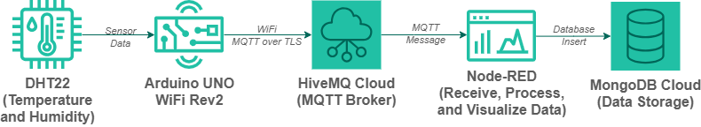

# IoT Temperature and Humidity Monitoring System

The system uses an **Arduino UNO WiFi Rev2** and **DHT22 sensor** to collect environmental measurements. The data is transmitted using **MQTT over TLS** to **HiveMQ Cloud**, processed and visualized using **Node-RED**, and stored in **MongoDB** for persistent data storage.

## Demo
▶️ [Watch Full Demo Video](https://youtu.be/loq12zat6X8)
---

## 📌 Project Overview

This project demonstrates the development and integration of an end-to-end IoT monitoring system, starting from sensor data acquisition at the edge device to secure communication, data processing, visualization, and database storage.

### System Flow

**DHT22 → Arduino UNO WiFi Rev2 → Wi-Fi → MQTT/TLS → HiveMQ Cloud → Node-RED → MongoDB**

The project was developed as a personal project to strengthen practical skills in:

- Embedded Systems
- IoT System Integration
- Sensor Integration
- MQTT Communication
- TLS-secured Communication
- Node-RED
- Cloud MQTT Broker
- Database Integration
- System Testing
- Technical Troubleshooting
- Technical Documentation

---

## 🎯 Project Objective

The objectives of this project are:

- Collect temperature and humidity data using a DHT22 sensor.
- Process sensor data using an Arduino UNO WiFi Rev2.
- Connect the microcontroller to a Wi-Fi network.
- Transmit sensor data using the MQTT protocol.
- Implement secure MQTT communication using TLS.
- Use HiveMQ Cloud as the MQTT broker.
- Receive and process MQTT messages using Node-RED.
- Visualize the sensor data.
- Store sensor measurements in MongoDB.
- Test and troubleshoot the complete IoT data pipeline.

---

## ⚙️ Key Features

- 🌡️ Temperature monitoring
- 💧 Humidity monitoring
- 📡 Wi-Fi connectivity
- 📬 MQTT communication
- 🔐 MQTT over TLS
- ☁️ HiveMQ Cloud MQTT broker
- 🔄 Node-RED data processing
- 📊 Data visualization
- 🗄️ MongoDB data storage
- 🔧 System testing and troubleshooting

---

## 🏗️ System Architecture

## 📚 Project Documentation

For the complete project documentation, including the development process, hardware setup, system architecture, implementation, testing, and troubleshooting:

**[View Full Project Documentation on Notion](https://vanilla-trouser-325.notion.site/Muhammad-Rizki-Portfolio-22c398bb10e382ff94b38197a8838ac8)**
